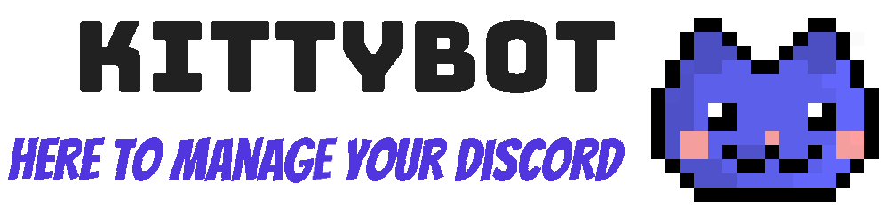

 

 
 

 

[CI Server](https://ci.anteiku.de/project/KittyBot_Bot?guest=1)

[Docker Hub](https://hub.docker.com/repository/docker/topisenpai/kittybot)

[Website Project](https://github.com/TopISenpai/KittyBot-Website)

[Website](https://kittybot.anteiku.de)
#### A Discord Bot to manage your roles
---

# hewe to manyage uw discowd

//TODO: README.md
